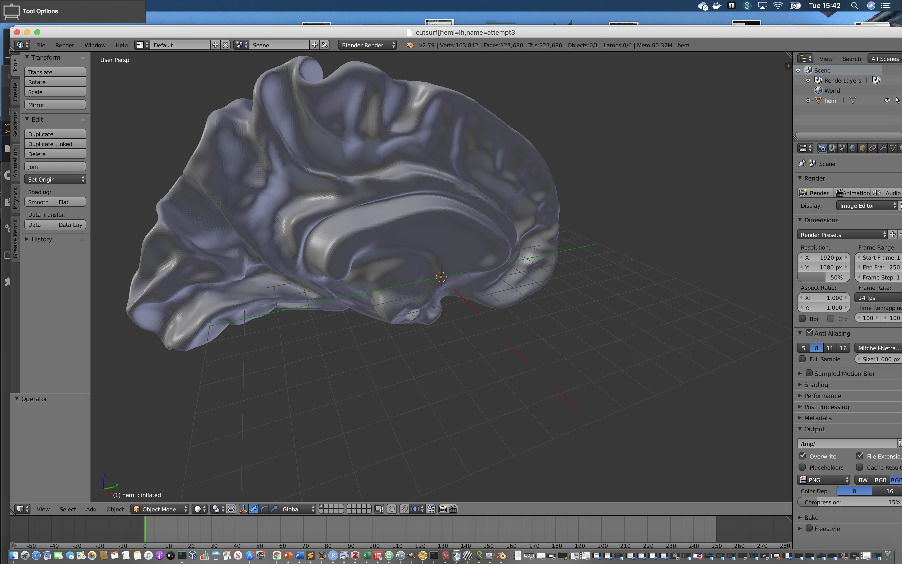
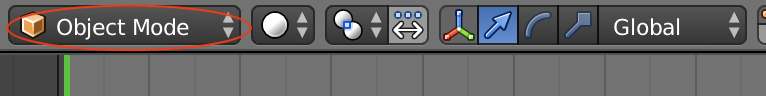
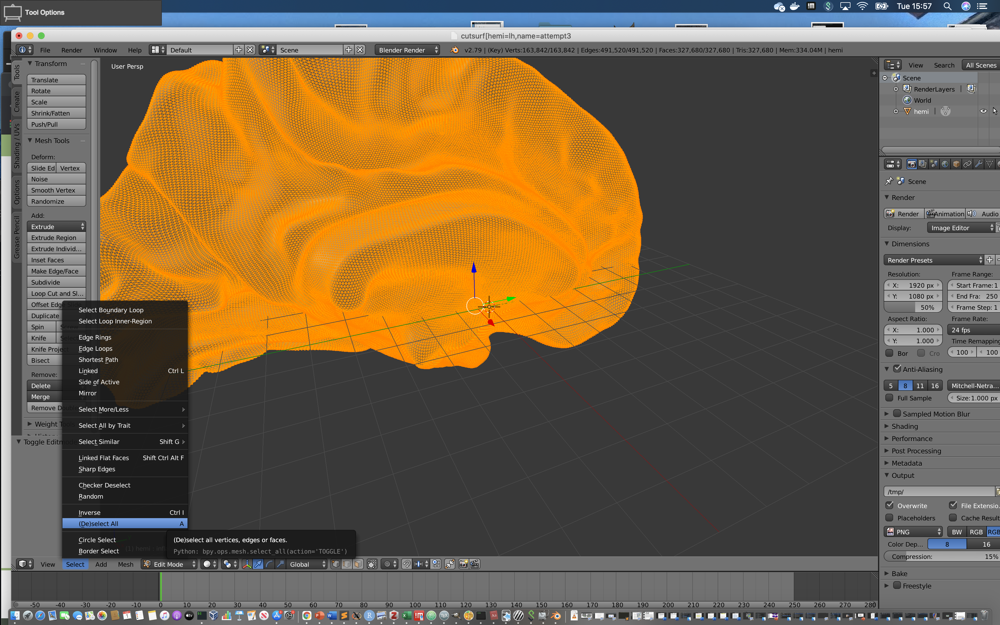
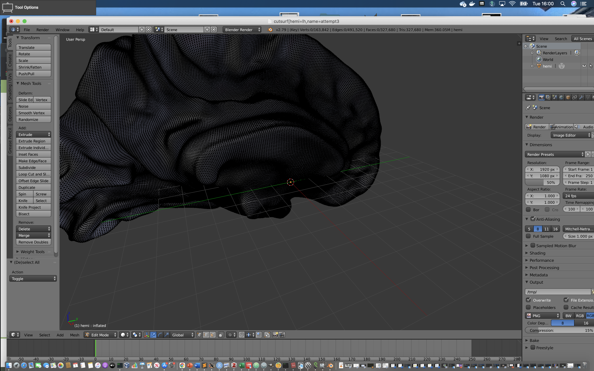
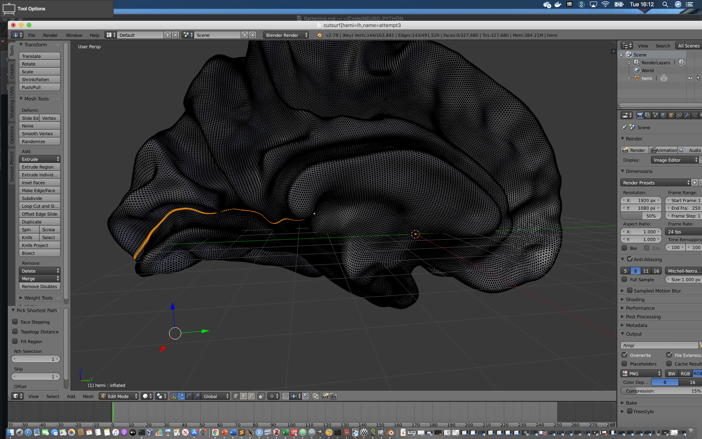
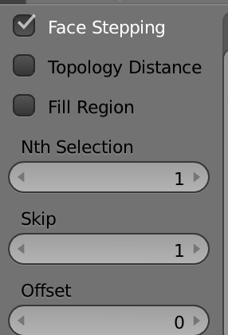
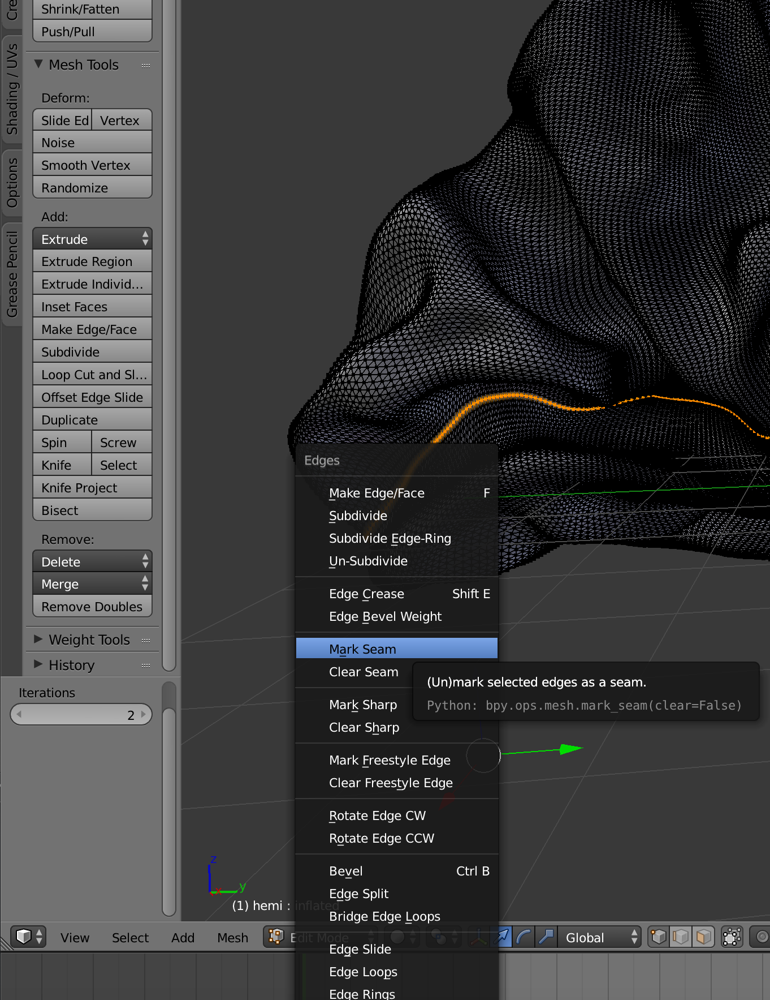
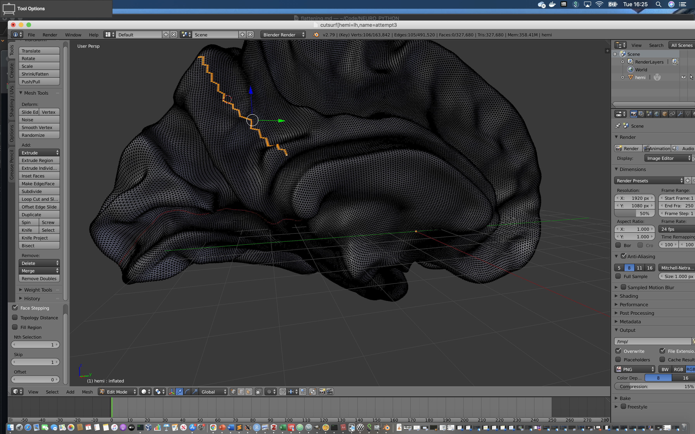
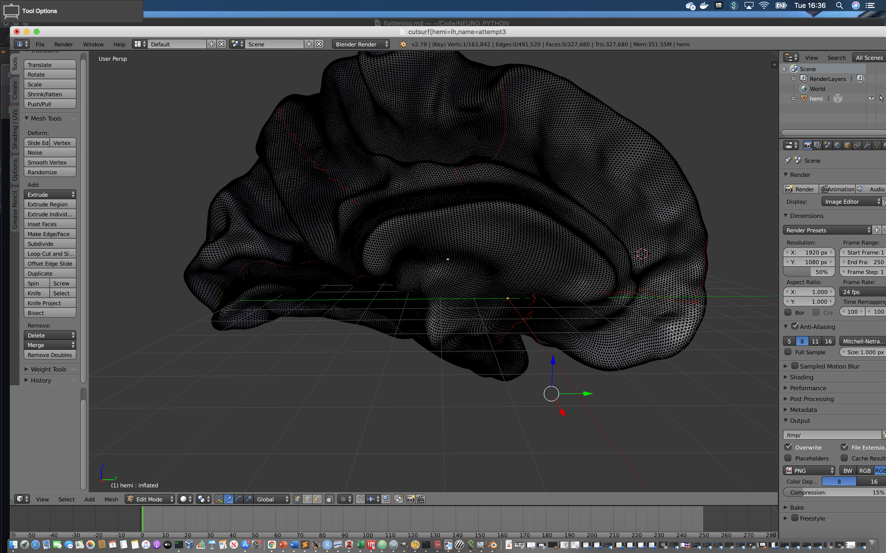
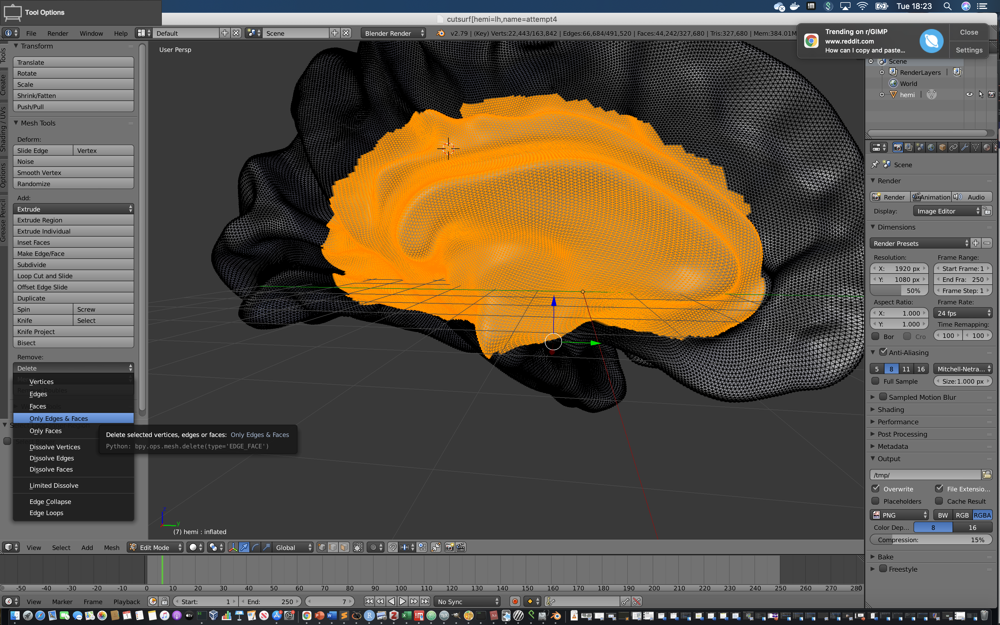

## Flattening a cortical surface using Pycortex and blender.

### In Python
The main command to run the flattening is:

```python
cortex.segment.cut_surface('fsaverage',hemi='lh',name='flatten_attempt')
```

The first argument is the name of your subject in your freesurfer directory.

The second is the hemisphere you wish to flatten

The third is the name you wish to assign to this attempt at flattening.

You can also specify the name of your freesurfer subject (if different from pycortex subject) with 'fs_subject='.

We have called this function without specifying any data to overlay on the surface. Supposedly this can be achieved with specifying a 'data' argument that points to a pycortex 'dataview' object. In principle, this would allow one to overlay a parcellation on top of the brain to aid cutting.  I have not had much success with this, however. My impression is that there is not much documentation on 'dataview' functionality - and so it isn't clear exactly how one prepares this.

### In blender


1. When this function is called, a blender window will open. You should see your hemisphere in the main window (see below). Note that the name of the file is consistent with the name you assigned to the cut_surface call.



2. You can navigate around by moving the mouse trackpad, which will rotate the camera in combination with shift/ control, which will translate/ zoom the camera.

3. In the panel that runs along the bottom of the main window you will see that the default is object mode. Use the dropdown to change this to 'Edit mode'




4. You will notice that the representation of the surface has changed so that all vertices appear in an orange color.


5. By default, blender appears to select all of these, as such, we need to use *select-deselect all* in the bottom panel.



6. The consequence is that we no longer see that all of the hemisphere is highlighted, instead, everything is turned to a grey-ish color.



7. Now, our job is to make a series of cuts to the surface. We want to make 5 relaxation cuts, followed by a final cut to take out the medial wall. For the location of these cuts, we may want to follow [this guide](https://github.com/VU-Cog-Sci/wiki/wiki/Cutting-inflated-FreeSurfer-surfaces-to-obtain-a-flattened-cortical-surface.).

8. The way the cuts are made in blender is as follows: Firstly, right click on a start vertex. This should make that vertex appear as orange. We next click right click on an end vertex whilst holding the control key. This will draw a path between the start and end point. You can do this as incrementally as you like, defining many end points via control+right click to an eventual destination.



9. We can modify the way in which this path is created via the various options in the bottom left panel.




10. We can then mark this as a 'seam' by pressing control+E and selecting the relevant option.




11. When we start to make the next cut, note that the previous line is now in red - indicating that it has been designated as a seam.




12. We continue this process until all radial cuts have been made.




13. We define a final cut to take out the medial wall. This is done slightly differently. To start we use the same steps as defined before - control right clicking a path until we eventually form a loop that intersects with the other seams that have been made. We need to make sure the first and last point of the selection are the same. Here though, we *do not mark our loop as a seam*.

14. Next go to *select- select loop inner region*  The filled selection will appear in orange.



 15. You can then go to *Transform - delete - only edges and faces*.

 16. The medial wall now disappears.

 17. Go to *file-save*

 18. Exit blender.

 ### Back to python

19. You should now be prompted with a message to inform you that freesurfer will now perform flattening. Select yes.


20. Repeat this process for the other hemisphere.
---
**TBC**
